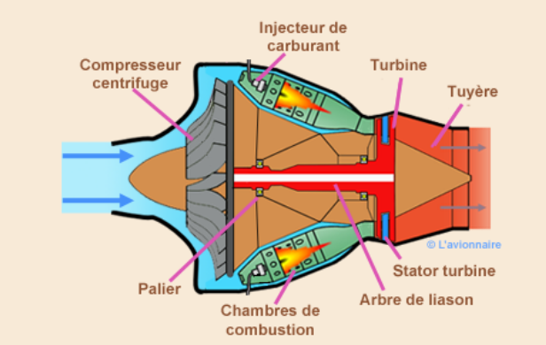

# 🚀 Projet - Réacteur miniature contrôlé par Arduino

## 🧠 Description du projet
Ce projet a pour but de **reproduire le fonctionnement d’un réacteur d’avion** à l’aide d’un **moteur électrique contrôlé par un Arduino Uno**.
Je me suis inspiré d'un turboréacteur à compresseur centrifuge equipant notamment les DH100 Vampire.

<p align="center">
  
  
</p>

Alors en **stage chez Safran**, j’ai pu approfondir mes compétences en **CAO (Conception Assistée par Ordinateur)** et en **mécanique des systèmes aéronautiques**.  
Ce projet m’a permis de **relier mes connaissances en mécatronique, électronique de puissance et modélisation 3D** pour créer une reproduction fonctionnelle et pédagogique d’un réacteur miniature.

L’objectif est de **simuler le comportement d’un réacteur** (entrée d’air, compression, combustion, turbine, tuyère) de manière visuelle et interactive.

---

## ⚙️ Matériel utilisé
- Arduino Uno  
- MOSFET N-channel
- Moteur DC 9V  
- Potentiomètre 10 kΩ  
- Résistance 220 Ω  
- Breadboard  
- Fils de connexion  
- Pile 9V
- Interrupteur
- Diode de roue libre

---

## 🔌 Schéma électronique
Le schéma suivant illustre les connexions entre les composants :

<p align="center">
  
  
</p>

Le **MOSFET** permet de contrôler la puissance fournie au moteur en fonction du signal PWM envoyé par l’Arduino.  
Le **potentiomètre** est relié à une entrée analogique pour ajuster la vitesse de rotation.

---

## 🧩 Fonctionnement
1. Le potentiomètre envoie une valeur analogique à l’Arduino.  
2. Cette valeur est convertie en signal PWM.  
3. Le MOSFET module la tension envoyée au moteur.  
4. Le moteur fait tourner la turbine, simulant le comportement d’un réacteur.

---

## 🖥️ Code Arduino
Le programme principal lit la valeur du potentiomètre et ajuste la vitesse du moteur proportionnellement :

```cpp
int potPin = A0;      // Entrée potentiomètre
int motorPin = 9;     // Sortie PWM vers le MOSFET
int potValue = 0;     

void setup() {
  pinMode(motorPin, OUTPUT);
}

void loop() {
  potValue = analogRead(potPin);
  int motorSpeed = map(potValue, 0, 1023, 0, 255);
  analogWrite(motorPin, motorSpeed);
}

