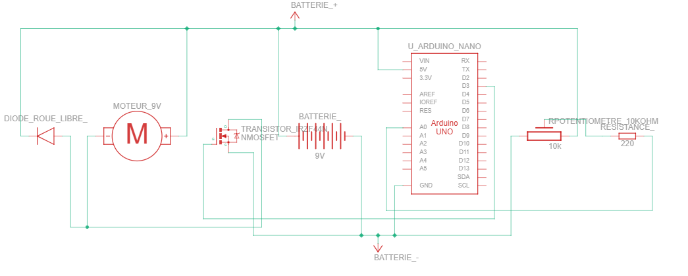
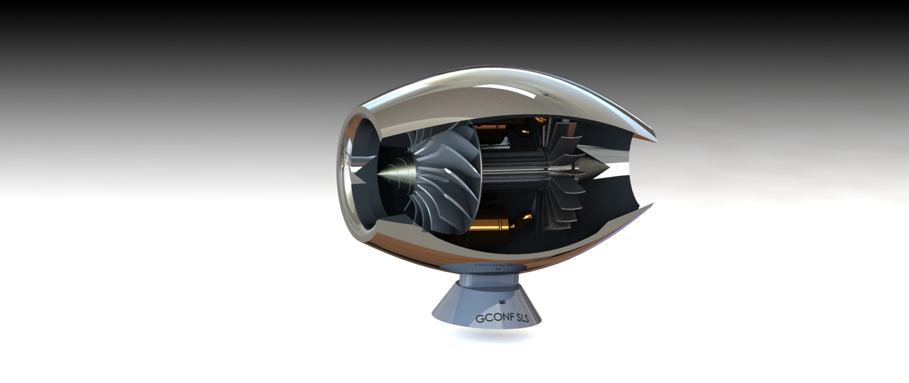

# 🚀 Projet - Réacteur miniature contrôlé par Arduino

## 🧠 Description du projet
Ce projet a pour but de **reproduire le fonctionnement d’un réacteur d’avion** à l’aide d’un **moteur électrique contrôlé par un Arduino Uno**.
Je me suis inspiré d'un turboréacteur à compresseur centrifuge equipant notamment les DH100 Vampire.

<p align="center">
  
  
</p>

Alors en **stage chez Safran**, j’ai pu approfondir mes compétences en **CAO (Conception Assistée par Ordinateur)** et en **mécanique des systèmes aéronautiques**.  
Ce projet m’a permis de **relier mes connaissances en mécatronique, électronique de puissance et modélisation 3D** pour créer une reproduction fonctionnelle et pédagogique d’un réacteur miniature.

L’objectif est de **simuler le comportement d’un réacteur** (entrée d’air, compression, combustion, turbine, tuyère) de manière visuelle et interactive.

---

## ⚙️ Matériel utilisé
- Arduino Uno  
- MOSFET N-channel
- Moteur DC 9V  
- Potentiomètre 10 kΩ  
- Résistance 220 Ω  
- Breadboard  
- Fils de connexion  
- Pile 9V
- Interrupteur
- Diode de roue libre

---

## 🔌 Schéma électronique
Le schéma suivant illustre les connexions entre les composants :

<p align="center">
  
  
</p>

Le **MOSFET** permet de contrôler la puissance fournie au moteur en fonction du signal PWM envoyé par l’Arduino.  
Le **potentiomètre** est relié à une entrée analogique pour ajuster la vitesse de rotation.

---

## 🧩 Fonctionnement
1.Le potentiomètre 10 kΩ envoie une valeur analogique à l’Arduino Uno.
2.Cette valeur est convertie en signal PWM par l’Arduino.
3.La résistance 220 Ω protège la sortie PWM, qui commande la gate du MOSFET N-channel.
4.Le MOSFET module la tension envoyée au moteur DC 9V.
5.Une diode de roue libre protège le circuit contre les surtensions générées par le moteur.
6.Le moteur fait tourner la turbine, simulant le comportement d’un réacteur.
7.L’ensemble est alimenté par une pile 9V, et un interrupteur permet de couper le circuit.
8.Le montage est réalisé sur une breadboard avec des fils de connexion.

---

## 🖥️ Code Arduino
Le programme principal lit la valeur du potentiomètre et ajuste la vitesse du moteur proportionnellement :

  ```cpp
  // Déclaration des broches
  const int potPin = A0;
  const int mosfetPin = D3;
  
  int potValue = 0;     
  int pwmValue = 0;         
  
  void setup() {
    pinMode(mosfetPin, OUTPUT); 
    Serial.begin(9600);      
  }
  
  void loop() {
    potValue = analogRead(potPin);
    pwmValue = map(potValue, 0, 1023, 0, 255);
  
    analogWrite(mosfetPin, pwmValue);
    Serial.print("Potentiomètre: ");
    Serial.print(potValue);
    Serial.print("  PWM: ");
    Serial.println(pwmValue);
  
    delay(10);  // Petite pause pour stabilité
  }
  ```
  ## 🖥️ Rendu photo et video

<p align="center">
  
  
  
  
</p>
